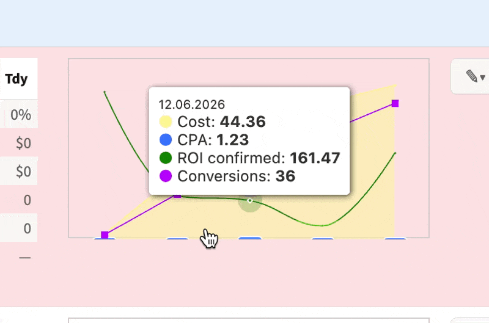

Original: https://app.notion.com/p/3821eb78a7bb808383e8e295b5619aa9?source=copy_link&session_sync_attempted=1

# тестовое простое

Вот график, который принимает 4 time-series последовательностями данных и рисует их в интерфейсе разными линиями:

1. area
2. spline
3. line
4. bar

https://cleanshot.com/share/cBDRxJWM

Задача - завайбкодить такой график, внимательно повторить стили графика и поведение, и прислать github-репо с инструкциями, как его инициализировать с четырьмя последовательностями данных.

